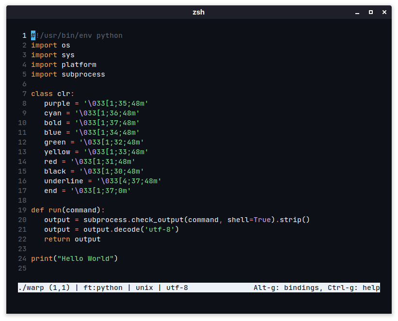

# micro-github
micro theme with the github color pallete, created by jobcmax
## activating theme
1. place github.micro into ~/.config/micro/colorschemes (create the folder if it doesn't exist).
2. Add export MICRO_TRUECOLOR=1 to your shell RC file (eg. bashrc, zshrc, config.fish).
3. Start a new instance of Micro, if the theme isn't available, press Ctrl+e to bring up the command prompt, type in set colorscheme dracula and execute (press Enter).
## preview:
</img>
